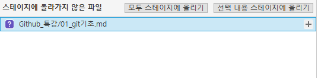
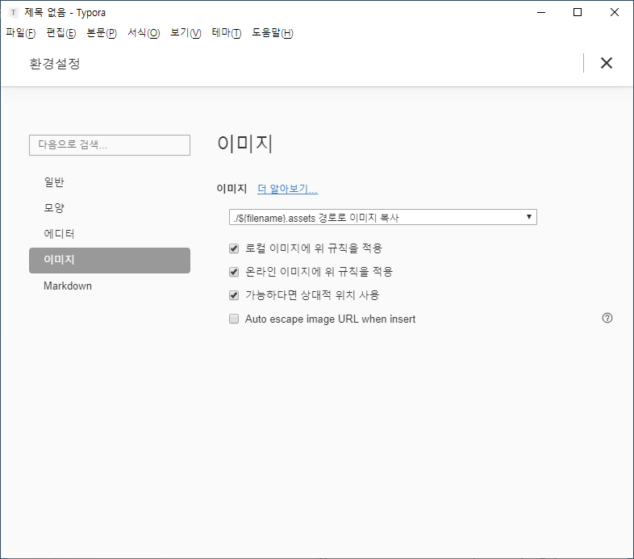

# Git 기초

## SCM이란?

### 소스코드

#### 코드코드

컨트롤 + 슬래쉬를 누르면 원래의 마크다운 언어로 보인다.

처음에 타이포라를 설정할 때 세팅을 해 주어야 한다. 첨부파일 참조.

단어를 파이프라인 표시와 함께 쓰면 테이블이 만들어진다.


source code manager의 약자로 코드의 버전을 관리하기 위해 존재한다.


###  git은 Linus Torvalds가 만든 SCM으로 현재 가장 많이 사용된다.

### github은 git이 관리하는 Repo의 원격 저장소를 제공하는 서비스다. 가장 많이 사용하며 오픈소스 프로젝트들이 성장하는 곳이다. 최근 MS에 인수되었다.


### Sourcetree 




| 명령어 | 설명 | 예시 |
| ------ | ---- | ---- |
|        |      |      |
| ``     |      |      |
|        |      |      |
|        |      |      |
|        |      |      |


```C#
public void main
```


Github 클론의 의미 - 연결


중급